

  

# 🎨 系统界面展示

## 🧱 海报墙预览

<table>
  <tr>
    <td align="center">
      <a href="imgs/系统公告.png">
        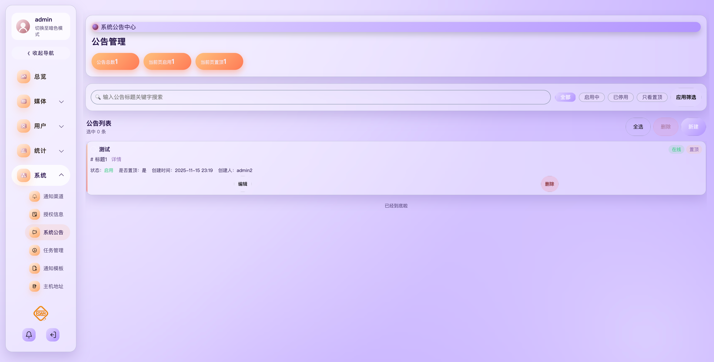
      </a>
       
      <b>系统公告</b>
    </td>
    <td align="center">
      <a href="imgs/主题中心.png">
        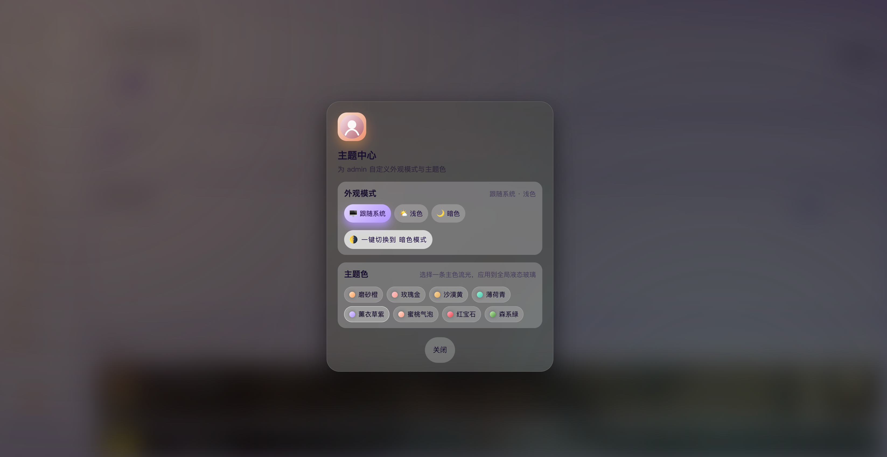
      </a>
       
      <b>主题中心</b>
    </td>
    <td align="center">
      <a href="imgs/赛博朋克主题.png">
        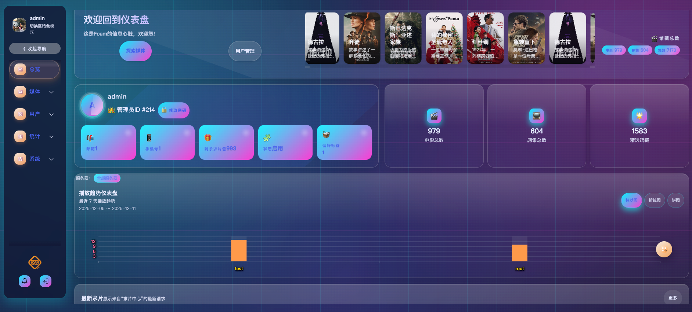
      </a>
       
      <b>赛博朋克主题</b>
    </td>
    <td align="center">
      
       
      <b>求片管理</b>
    </td>
  </tr>

  <tr>
    <td align="center">
      <a href="imgs/求片管理入库.png">
        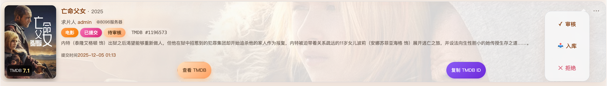
      </a>
       
      <b>求片管理入库</b>
    </td>
    <td align="center">
      <a href="imgs/播放统计.png">
        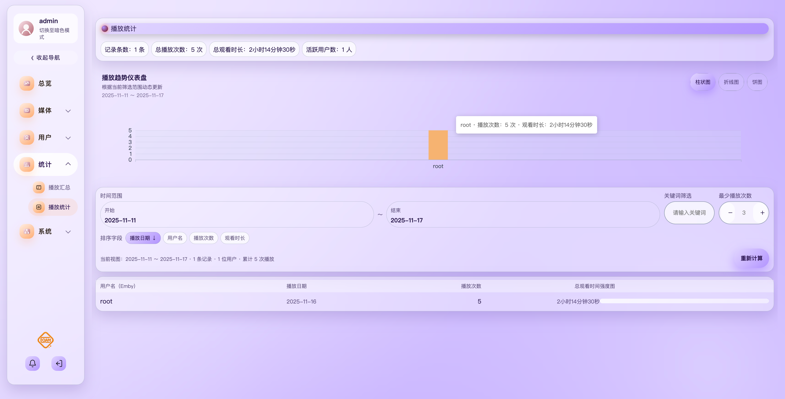
      </a>
       
      <b>播放统计</b>
    </td>
    <td align="center">
      <a href="imgs/系统配置.png">
        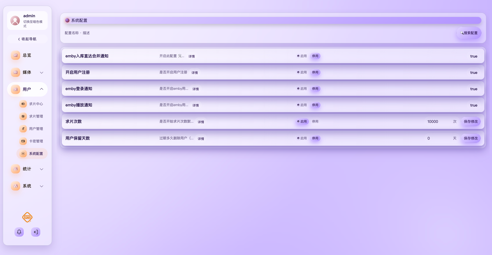
      </a>
       
      <b>系统配置</b>
    </td>
    <td align="center">
      <a href="imgs/卡密管理.png">
        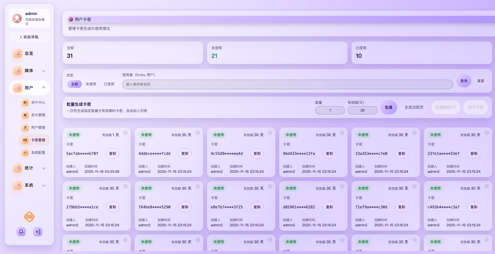
      </a>
       
      <b>卡密管理</b>
    </td>
  </tr>

  <tr>
    <td align="center">
      
       
      <b>播放汇总</b>
    </td>
    <td align="center">
      
       
      <b>媒体库</b>
    </td>
    <td align="center">
      
       
      <b>求片中心</b>
    </td>
    <td align="center">
      <a href="imgs/用户管理.png">
        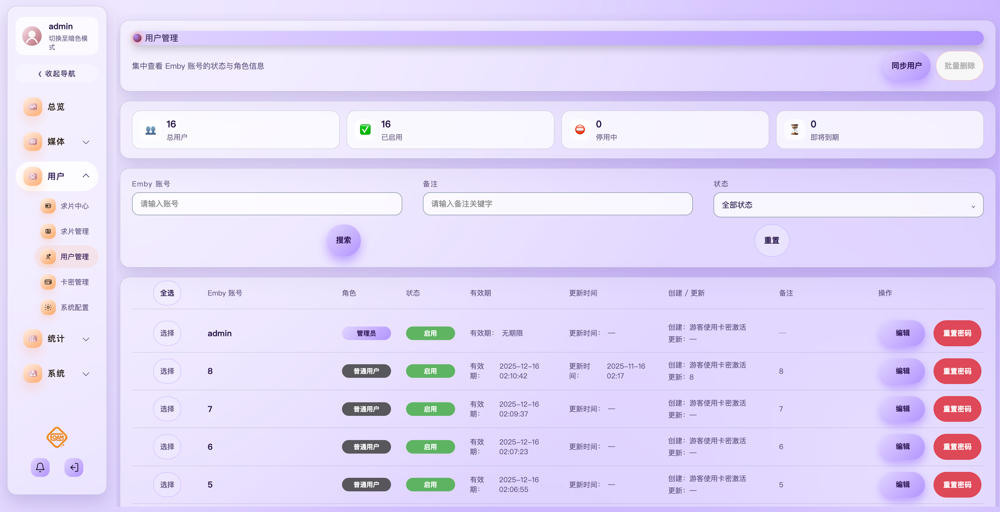
      </a>
       
      <b>用户管理</b>
    </td>
  </tr>

  <tr>
    <td align="center">
      
       
      <b>仪表盘</b>
    </td>
    <td align="center">
      
       
      <b>仪表盘2</b>
    </td>
    <td align="center">
      <a href="imgs/今日排行.jpg">
        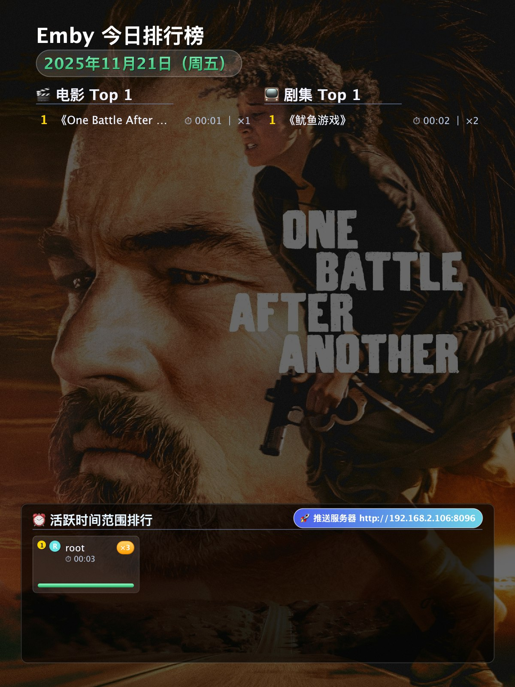
      </a>
       
      <b>今日排行</b>
    </td>
    <td align="center">
      
       
      <b>开始播放</b>
    </td>
  </tr>

  <tr>
    <td align="center">
      
       
      <b>停止播放</b>
    </td>
    <td align="center">
      
       
      <b>入库通知</b>
    </td>
    <td align="center">
      <a href="imgs/求片订阅.png">
        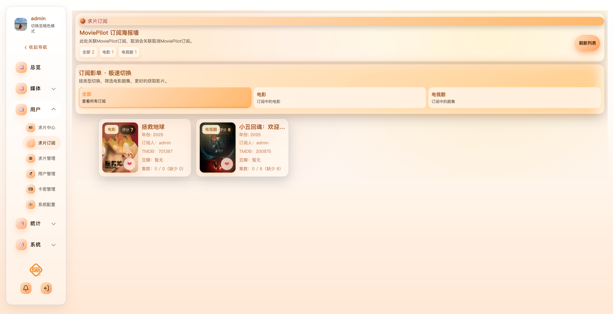
      </a>
       
      <b>求片订阅</b>
    </td>
    <td align="center">
      
       
      <b>自定义横版</b>
    </td>
  </tr>

  <tr>
    <td align="center">
      <a href="imgs/自定义竖版.jpg">
        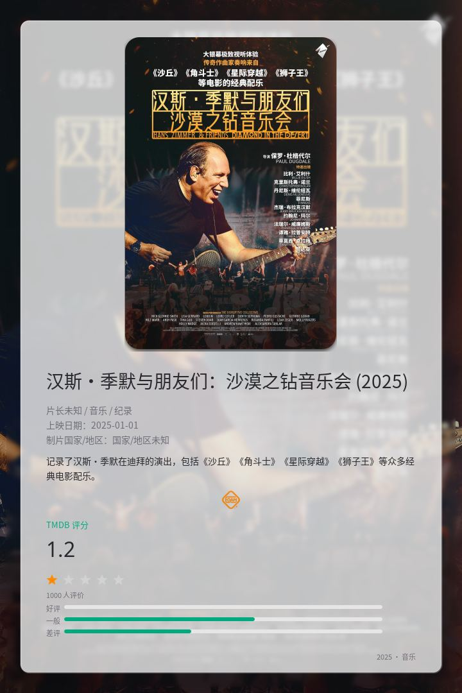
      </a>
       
      <b>自定义竖版</b>
    </td>
    <td align="center">
      <a href="imgs/屏蔽播放设备.png">
        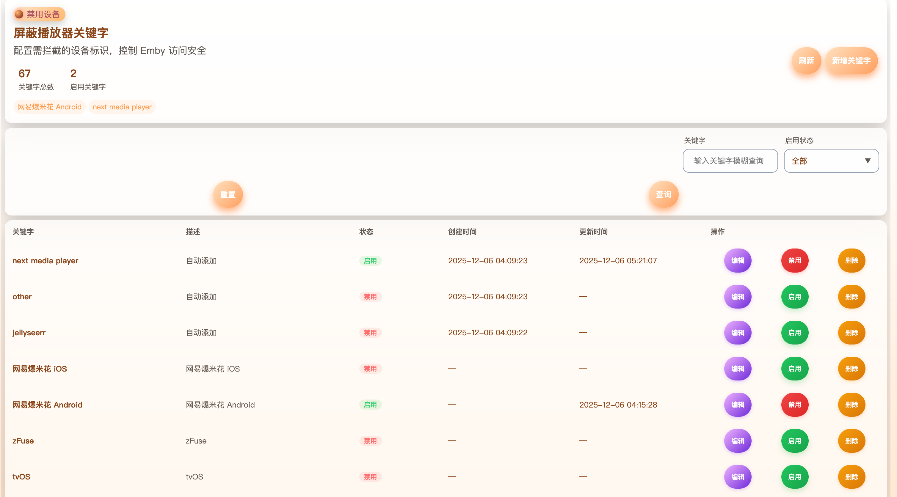
      </a>
       
      <b>屏蔽播放设备</b>
    </td>
    <td align="center">
      <a href="imgs/机器人操作面板.png">
        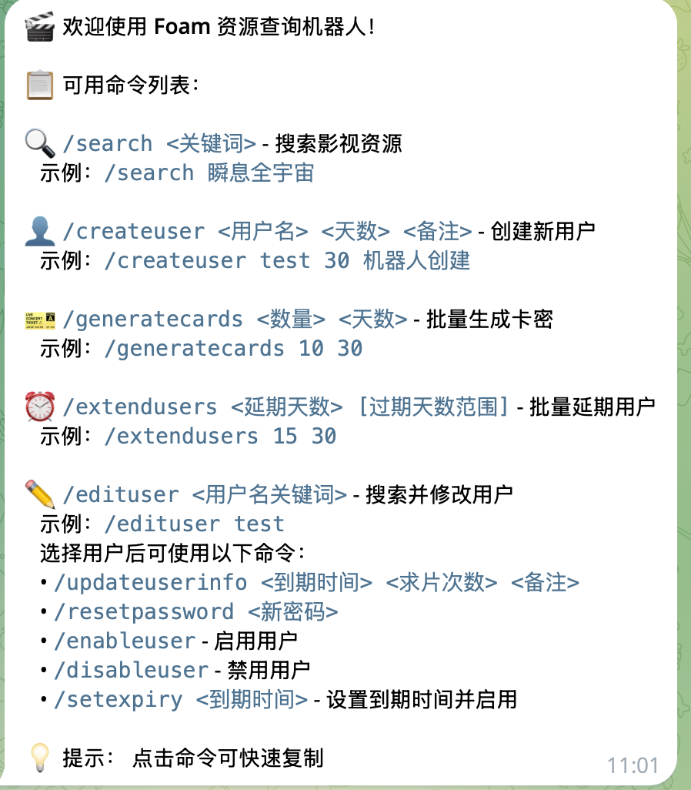
      </a>
       
      <b>机器人操作面板</b>
    </td>
    <td align="center">
      <a href="imgs/emby服务器用户同步.png">
        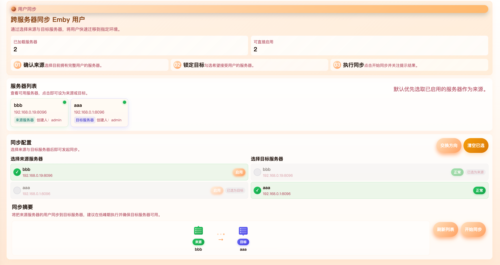
      </a>
       
      <b>用户同步</b>
    </td>
  </tr>

  <tr>
    <td align="center">
      <a href="imgs/企业微信应用.png">
        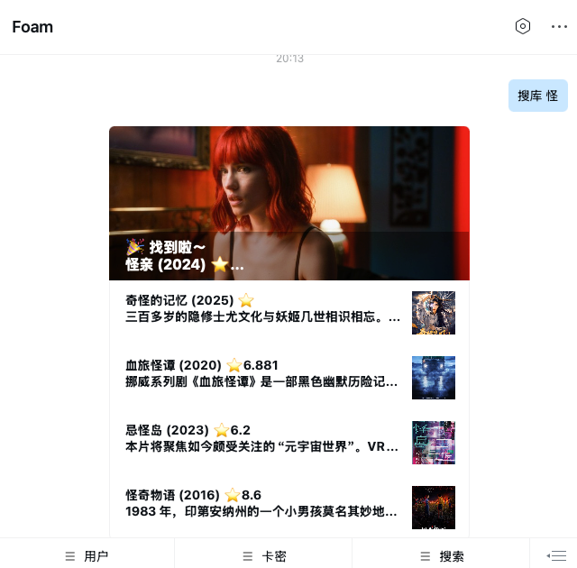
      </a>
       
      <b>企业微信应用</b>
    </td>
    <td align="center">
      <a href="imgs/邀请系统.png">
        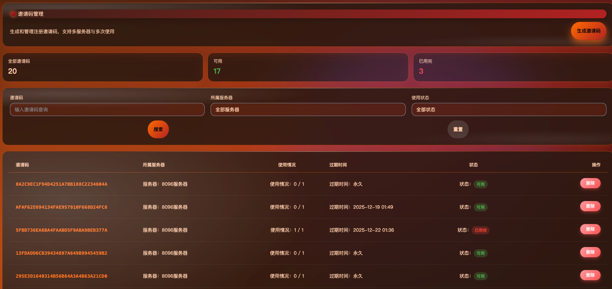
      </a>
       
      <b>邀请系统</b>
    </td>
    <td align="center">
      
       
      <b>开始播放(手机)</b>
    </td>
    <td align="center">
      <a href="imgs/暂停播放.jpg">
        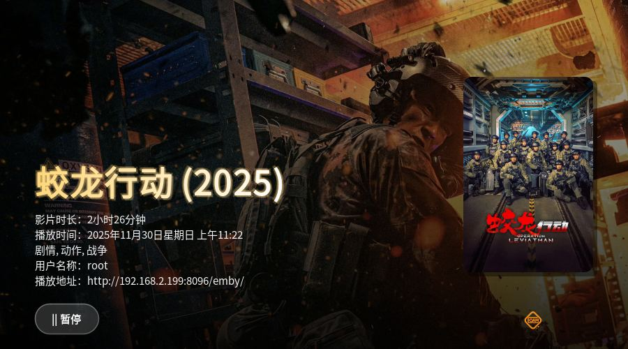
      </a>
       
      <b>暂停播放(手机)</b>
    </td>
  </tr>

  <tr>
    <td align="center">
      <a href="imgs/积分系统.png">
        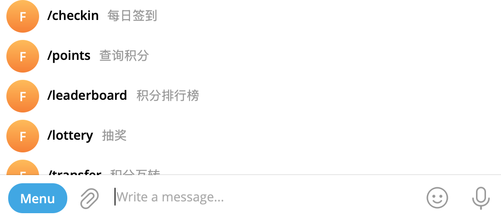
      </a>
       
      <b>积分系统</b>
    </td>
    <td align="center">
      
       
      <b>系统公告</b>
    </td>
    <td align="center">
      
       
      <b>主题中心</b>
    </td>
    <td align="center">
      
       
      <b>仪表盘</b>
    </td>
  </tr>

<tr>
    <td align="center">
      
       
      <b>追剧1</b>
    </td>
    <td align="center">
      <a href="imgs/追剧2.png">
        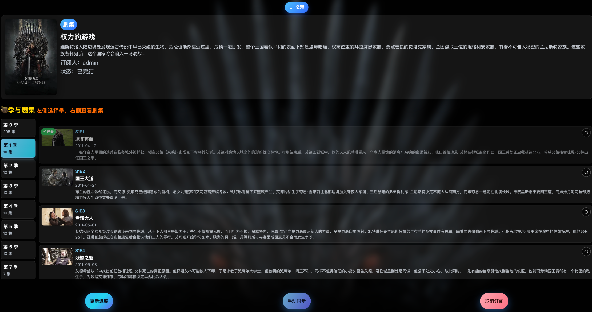
      </a>
       
      <b>追剧2</b>
    </td>
</tr>

</table>