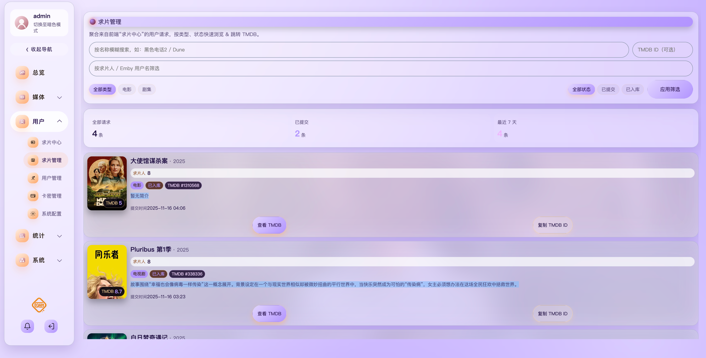
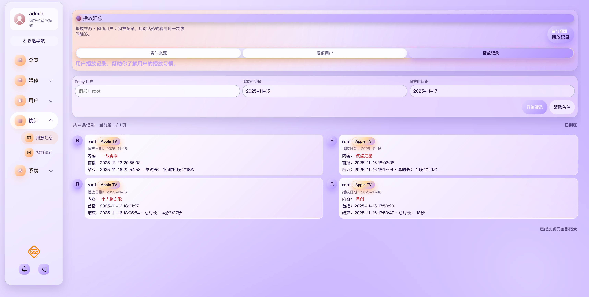

# 🌊 Foam — Emby 管理系统

## 📌 版本信息（Version）

- 当前版本：**latest**
- 更新日志详见：[`CHANGELOG.md`](./CHANGELOG.md)

---

## 🕘 更新历史（Changelog 概览）

### v1.0（2025-11-17）
- ✨ Dashboard 仪表盘搭建，支持基础统计信息展示
- ✨ 完成通知模板中心、服务器配置等核心管理页面
- 🧩 完善全局毛玻璃 + 暗色主题视觉体系


> **现代化 · 高颜值 · 全功能** 的 Emby 多用户管理系统
> 支持用户管理、续费、卡密、请求中心、播放统计、公告通知等完整功能模块。


## ✨ 功能亮点
- 🔥 全套 Emby 用户管理能力
- 🪄 精致 UI（玻璃拟态 + 高斯模糊）
- 📊 播放统计可视化
- 📬 多渠道通知（Tg、钉钉）
- 🎫 卡密系统（支持自定义天数卡密） + 用户续费
- 🎬 影片请求中心
- 📱 完美适配移动端
- 🛥 支持多Emby服切换


## 🚀 部署方式
### 本地运行
```shell
version: '3'
services:
  foam-api:
    image: ciwei123321/foam-api:latest
    privileged: true
    ports:
      - "8080:8080"
    volumes:
      - ./data:/data
      - /etc/hosts:/etc/hosts
    container_name: foam-api
    restart: always
    environment:
      #db:3306 使用的是容器内部的端口 不是映射完的端口
      - SPRING_DATASOURCE_URL=jdbc:mysql://db:3306/foam-api?useUnicode=true&characterEncoding=utf8&useSSL=false&serverTimezone=GMT%2B8&allowPublicKeyRetrieval=true
      - SPRING_DATASOURCE_USERNAME=root
      - SPRING_DATASOURCE_PASSWORD=password
      - EMBY_APIKEY=apikey
      - EMBY_URL=http://ip:port/emby/
      - EMBY_COPYFROMUSERID=复制emby用户id # 复制emby用户权限
      # 需要配置tmdb接口hosts
      - TMDB_APITOKEN=tmdb api token
      - TMDB_APIKEY=tmdb api key
      - TMDB_IMAGE_URL=https://image.tmdb.org/t/p/original
      - TZ=Asia/Shanghai
      # 代理地址
      - HTTP_PROXY_ENABLED=true
      - HTTP_PROXY=http://ip:port
      - HTTPS_PROXY=http://ip:port
      - NO_PROXY=172.17.0.1,127.0.0.1,localhost,foam-api-search
      # lisence配置文件
      - LICENSE_FILE=/data/license.dat
      # 搜索接口地址 pansou地址
      - EMBY_HUB_SEARCH_URL=
    networks:
      - foam-network
    links:
      - db
    depends_on:
      - db

  db:
    image: mysql:8.4.6
    container_name: mysql_container
    environment:
      MYSQL_ROOT_PASSWORD: password
      MYSQL_DATABASE: foam-api
      TZ: "Asia/Shanghai"
      LANG: en_US.UTF-8
    command:
      - mysqld
      - --character-set-server=utf8mb4
      - --collation-server=utf8mb4_unicode_ci
      - --group_concat_max_len=102400
    ports:
      - "3306:3306"
    volumes:
      - ./mysql-data:/var/lib/mysql
    restart: always
    networks:
      - foam-network

  foam:
    image: ciwei123321/foam:latest
    container_name: foam
    restart: always
    ports:
      - "8081:80"
    environment:
      API_BASE_URL: "http://foam-api:8080"
      TZ: Asia/Shanghai
      IMAGE_URL: https://image.tmdb.org/t/p/
    networks:
      - foam-network
    links:
      - foam-api
    depends_on:
      - foam-api

networks:
  foam-network:
```

### 🐳 Docker 部署
```shell
docker-compose up -d
```
访问：http://localhost:8081


## 🎨 系统界面展示

### 🖼️ ScreenShot_2025-11-17_004848_519.png


### 🖼️ ScreenShot_2025-11-17_004908_229.png


### 🖼️ ScreenShot_2025-11-17_005114_910.png


### 🖼️ ScreenShot_2025-11-17_004350_733.png


### 🖼️ ScreenShot_2025-11-17_004314_292.png


### 🖼️ ScreenShot_2025-11-17_004303_663.png


### 🖼️ ScreenShot_2025-11-17_004332_161.png


### 🖼️ ScreenShot_2025-11-17_004147_759.png


### 🖼️ ScreenShot_2025-11-17_004226_244.png


### 🖼️ ScreenShot_2025-11-17_004252_461.png


### 🖼️ ScreenShot_2025-11-17_004116_915.png


## 🧩 系统功能说明
### 👥 用户管理
- 查看用户列表
- 编辑用户资料
- 删除 / 禁用账号
- 同步 Emby 用户


### 🔑 用户续费
- 查看到期用户
- 延长有效期
- 批量续期


### 💳 卡密管理
- 批量生成卡密
- 卡密使用状态
- 卡密兑换续期


### 📈 播放统计
- 播放次数排行榜
- 用户观看排行
- 记录明细


### 🎬 请求中心
- 用户提交内容请求
- 管理员审核处理
- 请求状态跟踪


### 🔔 通知渠道
- 钉钉机器人
- Tg机器人
- 多渠道组合推送


### 📝 公告管理
- 发布系统公告
- 置顶 / 排序
- 多端展示

### 🛺 Emby多服务器支持
- 支持添加多个Emby服务器 无缝切换 数据隔离